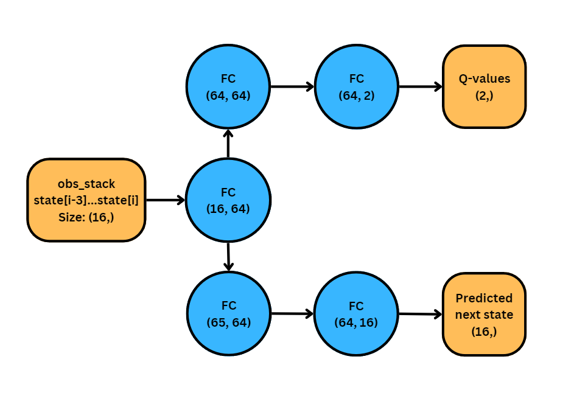
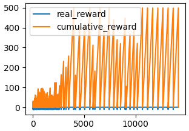
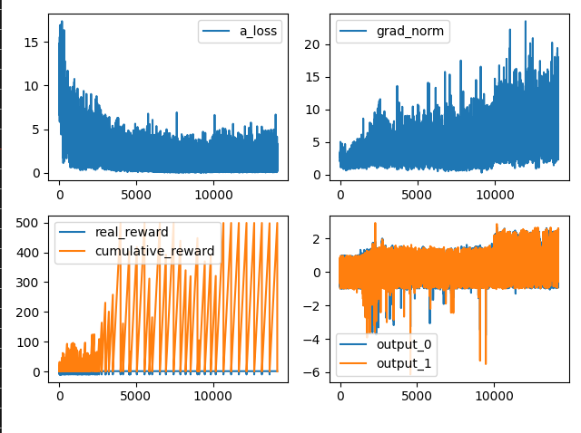

# Cartpole-V1 consistent max-score in about 10,000 frames

This is a model-based Double-DQN policy. The architecture is show below:



It is commonly thought that reinforcement learning methods (particularly DQN) need millions of training samples to reach optimality.
In the case of cartpole-v1 the number of states `4^n`, where `N` is the amount of segements the number line is broken into into. However, the transitions between states are relatively continuous and therefore should easily be graphed. In-fact cartpole v1 has been solved in 0-shot learning with other algorithms.





## Setup

```python
python main.py
```

The model is currently in demonstration mode. If you want to train a new model you can change these lines back to default:

- model_to_load = "models/actor_model_23500.pth" --> ""

- step = 23500 --> 0

- DISABLE_RANDOM = True --> False

- SAVING_ENABLED = False --> True


## OPTIONAL changes:
- SNAPSHOT_INTERVAL = 1 --> 25
- SHOW_FIRST = True --> False

These two changes speed up training by only rendering at certain intervals, and not the first "random" epoch.

