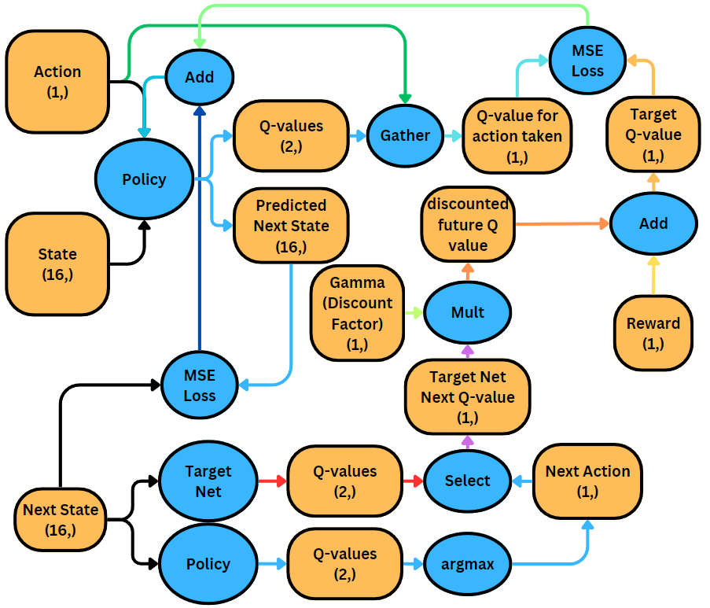

# Cartpole-V1 consistent max-score in about 10,000 frames

This is a model-free Double-DQN policy, which uses a sub-policy of predicting the next action to improve training.

It is commonly thought that reinforcement learning methods (particularly DQN) need millions of training samples to reach optimality.
In the case of cartpole-v1 the number of states `4^n`, where `n` is the amount of sub-segements 1 unit of the number line is broken into into. However, the transitions between states are relatively continuous and therefore should easily be graphed. In-fact cartpole v1 has been solved in 0-shot learning with other algorithms.

That said, my model is able to solve the problem with only 10000 frames of training, approximately 2 minutes using my home computer running a RTX 2080 Ti.
This coincides with the hard-update to the target model. Further testing is required in this area.

## Architecture

The concatenated 4 previous states are combined for a total of 16 values as the input. The model branches after the first fully-connected (FC) layer. One head predicts the Q-values, and the other head predicts the next state given the current action.

These are modified automatically using the variables `env.observation_space` and `env.action_space`, conveniently provided by gymnasium.

## Inference

The state, action, next state, and reward are saved into a transition, to be used in training.

## Training

Given a previous transition, containing state, action, next state, and reward. The model is a Double-DQN where the policy network predicts the next action, and the target net, which is essentially an infrequently-copied copy of the policy network. The target net predicts the Q-value of the predicted action for training stability.

## Graphs
### Cartpole

Cartpole appears to be technically solved starting from around 5,000 frames, and completely solved from around 10,000 frames. Strangely, coinciding with the first hard-copy to the target net at 10,000 frames. (Approximately 1-2 minutes in real time)

### Lunar Lander

Lunar Lander appears to be consistently solved in around 90,000 frames. However, it reaches a solved score above 200 in only 40,000 frames. (Approximately 7 or 14 minutes in real time)


Later, I added surprisal, and the problem could be solved in just over 11,000 steps. Surprisal uses the error of the next-state prediction sub-goal to adjust the reward. A higher difference represents a "surprise" that the model didn't expect, or hasn't encountered before. This promotes exploring states the model hasn't seen before, and is better than greedy epsilon alone. This model uses a static 5% random action chance (epsilon=0.05)


This is an example of some landings at around 30,000 steps. The model is not consistent at this point, possibly attributed to the 1/20 random actions, but it does solve the environment quite frequently. And surprisal allowed it to try out turning off the engines very early on in the training process.

You can see the lander gets stuck hovering occasionally, I believe this is due to the surprisal being over-weighted, however, eventually this behavior would disappear as the next-state predictor improves.

## Setup
1. Download the code.
2. Make sure you have python3.
3. Run this to install dependencies and start the model:
```bash
pip install -r requirements.txt
python [run-file]
```
eg.
```bash
python cartpole.py
python lunarlander.py
```

The model is currently in demonstration mode. Have a look through the config file.

If you want to train a new model you can change some lines:
```python
# Path to the model file to load. Alternatively, "" to start with a fresh model.
model_to_load = "" #"models/actor_model_23500.pth"
step = 0 # This is here because it's appended to the name of the save file, it counts up by 1 each frame. [Default: 0]

SNAPSHOT_INTERVAL = 1 # The number of epochs between showing the human visualization. [Default: 25]
SHOW_FIRST = True # Regardless of snapshot interval, epoch 0 won't show a visualization, unless this is TRUE. [Default: False]

DISABLE_RANDOM = False # Disable epsilon_greedy exploration function. [Default: False]
SAVING_ENABLED = False # Enable saving of model files. [Default: True]
LEARNING_ENABLED = True # Enable model training. [Default: True]
```